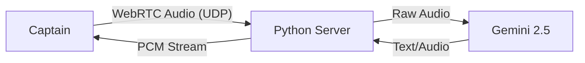

# 🎙️ Ada VHF: FastRTC Voice Gateway

**Status:** Experimental Node (`ada.vhf`)
**Technology:** FastRTC, WebRTC, Gemini Flash 2.5

## 1. Why FastRTC?
Traditional "Voice AI" usually involves:
1.  Frontend records audio blob.
2.  Uploads to server (HTTP POST).
3.  Server transcribes (Whisper).
4.  Server thinks (LLM).
5.  Server generates audio (TTS).
6.  Server sends MP3 back.

This creates **3-5 seconds of latency**. In a maritime VHF radio context, this feels unnatural.

**FastRTC** opens a **WebRTC Data Channel**. Audio packets flow continuously.
*   **VAD (Voice Activity Detection):** The server knows instantly when you stop speaking.
*   **Interruptibility:** You can speak over Ada (Break-in), just like a real radio channel.

## 2. Architecture

## 3. Integration with Ada Stargate

We treat the `vhf_radio.py` service as a specialized **Expert Node**.

*   **Host:** Runs inside the Backend container.
*   **Mount:** Accessible via `/radio` path.
*   **Observability:** The Python script logs every transmission to the Redis Event Bus, so the GM Dashboard sees:
    > `[VHF-CH72] Incoming: "Requesting docking instructions..."`

## 4. How to Use
Navigate to `http://localhost:3000/radio` (proxied) or `http://localhost:8000/radio` to access the dedicated radio interface.
