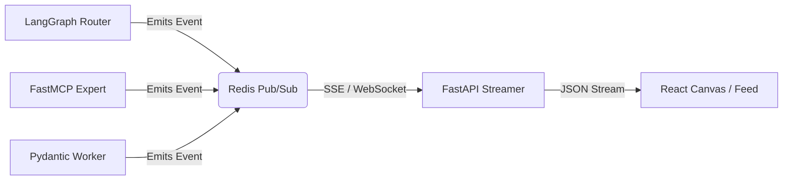

# 👁️ ADA OBSERVABILITY: The "Code Hooks" Protocol

**Reference:** [Claude Code Hooks & Multi-Agent Observability](https://github.com/disler/claude-code-hooks-multi-agent-observability)

## 1. The Philosophy: "Glass Box" AI
In a "Zero Error" system, you must see *how* the AI reached a conclusion.
*   **Opaque:** The user sees only the final answer ("Departure Approved").
*   **Observable (Ada):** The user sees the live stream of thought:
    1.  `Router` received request.
    2.  `Router` delegated to `ada.finance`.
    3.  `ada.finance` ran SQL query `SELECT balance FROM vessels...`.
    4.  `ada.finance` detected debt.
    5.  `Router` blocked departure.

## 2. The Architecture: Event Bus

We decouple the **Reasoning (Python Backend)** from the **Visualization (React Frontend)** using a real-time Event Bus (Redis Pub/Sub + SSE).



## 3. The Protocol: `HookEvent`

Every action in the Python backend emits a standard JSON payload. This payload maps directly to the `AgentTraceLog` interface in the frontend.

```json
{
  "id": "evt_123456789",
  "timestamp": "2025-11-20T10:00:00Z",
  "source_node": "ada.finance",  // The Agent Name
  "event_type": "TOOL_EXECUTION", // THINKING, ROUTING, ERROR, OUTPUT
  "payload": {
    "tool": "check_debt",
    "input": { "vessel_name": "Phisedelia" },
    "output": { "balance": 850.0 }
  },
  "level": "INFO" // INFO, WARNING, CRITICAL
}
```

## 4. Implementation Guide

### A. Backend (Python Decorator)
We define a `@hook` decorator that wraps every FastMCP tool and LangGraph node.

```python
# backend/hooks/emitter.py
import redis
import json

r = redis.Redis(host='localhost', port=6379)

def emit_hook(source: str, event_type: str, payload: dict):
    event = {
        "source_node": source,
        "event_type": event_type,
        "payload": payload
    }
    r.publish('ada_events', json.dumps(event))

# Usage in an Agent
@mcp.tool()
async def calculate_penalty(days: int):
    emit_hook("ada.legal", "THINKING", {"msg": f"Calculating for {days} days"})
    # ... logic ...
```

### B. Frontend (React Consumer)
The `App.tsx` or `Canvas.tsx` subscribes to the stream.

```typescript
// Frontend: EventSource
useEffect(() => {
  const sse = new EventSource('/api/v1/stream/events');
  
  sse.onmessage = (event) => {
    const hookData = JSON.parse(event.data);
    // Push to Logs Array
    setLogs(prev => [transformHookToLog(hookData), ...prev]);
  };
}, []);
```

## 5. Benefits for WIM
1.  **Debugging:** If a wrong invoice is generated, you can scroll back and see exactly which "Worker" script calculated the wrong VAT.
2.  **Trust:** The GM can see `ada.legal` actually checking the database, building trust in the AI's authority.
3.  **Speed:** The UI feels instant because "Thinking" logs appear before the final answer is ready.
