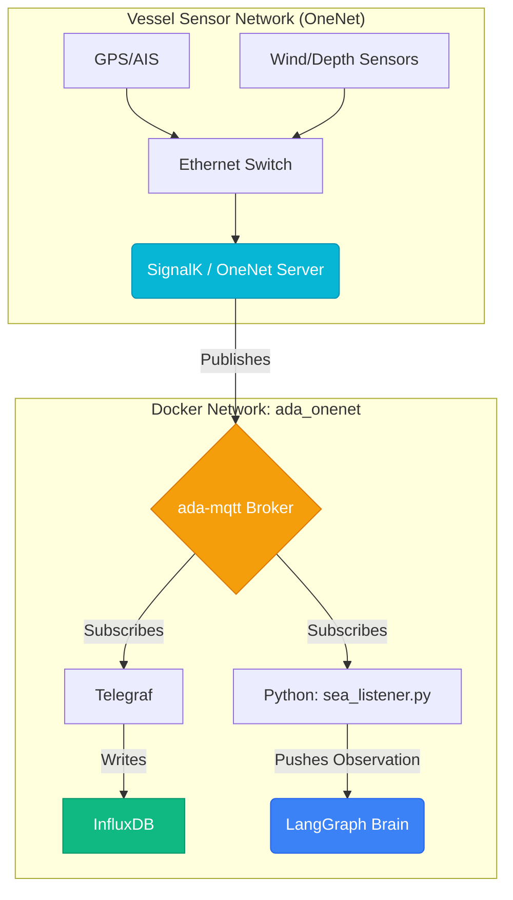

# 🌊 Ada.Sea: Live Data Pipeline Architecture (OneNet Edition)

**Objective:** To provide the `ada.sea` agent with real-time, persistent, and queryable maritime telemetry data from a modern, IP-based native backbone.

---

## 1. Component Overview

| Component | Technology | Role |
| :--- | :--- | :--- |
| **Sensor Hub** | **SignalK / OneNet Gateway** | Aggregates all vessel sensor data onto an IP network. |
| **Publisher** | **signalk-mosquitto** | Publishes the unified data stream to an MQTT broker. |
| **Broker** | **Mosquitto** | The "Nervous System" that distributes sensor data in real-time. |
| **Collector** | **Telegraf** | Subscribes to MQTT and writes data into the time-series database. |
| **Database** | **InfluxDB** | The "Long-Term Memory" for sensor data history. |
| **Real-time Ear**| **`sea_listener.py`**| A Python script giving the LangGraph brain live awareness. |

---

## 2. Data Flow Diagram

### Flow Explanation:
1.  All vessel sensors connect to a central **OneNet Gateway** over a standard IP network (Ethernet).
2.  The gateway publishes a unified data stream to the **`ada-mqtt` broker**.
3.  **Telegraf** listens to MQTT and archives all data in **InfluxDB** for historical analysis.
4.  Simultaneously, the **`sea_listener.py` script** listens to the same MQTT stream, allowing the AI brain to react to events in **real-time**.

This architecture provides Ada with both a perfect memory of the past (InfluxDB) and a live connection to the present (MQTT), all running on a modern, robust IP backbone.
