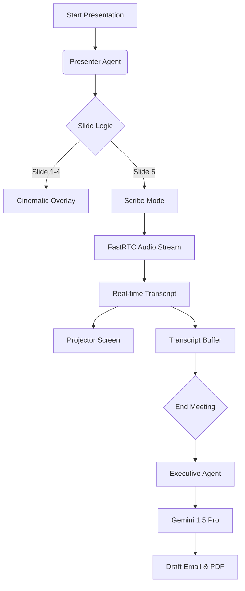

# 📽️ ADA PRESENTATION & SCRIBE MODE PROTOCOLS

**Objective:** Transform the Marina Control System into a Client-Facing Presentation & Negotiation Tool.

---

## 1. THE CONCEPT: "Transparent Intelligence"
Instead of hiding the screen, we project it.
We show the client exactly what the system sees—the live radar, the occupancy stats, and the "Live Ledger" of our conversation. This radical transparency builds absolute trust.

---

## 2. PHASE 1: THE KEYNOTE (Slides 1-4)
*   **Controller:** `presenterExpert`
*   **Visuals:** Cinematic overlays, heavy on motion graphics (Brain, Radar, Network).
*   **Narrative:** Ada introduces herself, demonstrates her sensory network (IoT), and establishes her authority as the Marina OS.

### The Flow
1.  **Intro:** "I am Ada. Not a chatbot, but a Cognitive Entity."
2.  **Senses:** "I see 20nm out. I feel the wind on Pontoon A." (Live Data Injection).
3.  **Brain:** "I calculate yield and risk in milliseconds."
4.  **Handover:** "The floor is yours, Ahmet Bey."

---

## 3. PHASE 2: THE SCRIBE (Slide 5 - "Live Ledger")
*   **Controller:** `executiveExpert`
*   **Visuals:** A minimalist, high-contrast Terminal interface.
*   **Behavior:**
    *   **Microphone:** ALWAYS ON.
    *   **Screen:** Words appear as they are spoken (Matrix/Typewriter effect).
    *   **Audio:** Only speaks if addressed directly by name ("Ada, confirm that.").

### The Psychology of the Live Ledger
When a client sees their own words appearing on the screen ("We agree to 11,250 Euro"), it acts as a psychological contract. It prevents ambiguity and "he said/she said" disputes later.

---

## 4. PHASE 3: THE DELIVERABLE (Post-Meeting)
Once the "End Meeting" button is pressed, the **Executive Agent** executes the following logic:

### Step 1: Fact Extraction
It parses the transcript for:
*   **Financials:** Agreed Price, Discount Rate, Payment Terms.
*   **Operations:** Arrival Date, Berth Assignment, Special Requests (e.g., "700T Lift").
*   **Action Items:** "Send invoice tomorrow", "Check insurance".

### Step 2: Document Generation
It generates two artifacts using the `Gemini 1.5 Pro` model:
1.  **The Minutes:** A formal PDF summary.
2.  **The Proposal:** A "Ready-to-Sign" email draft.

### Step 3: Execution
*   The proposal is placed in the "Drafts" folder of the General Manager.
*   The Berth is tentatively reserved in the system (`ada.reservations`).

---

## 5. TECHNICAL ARCHITECTURE

